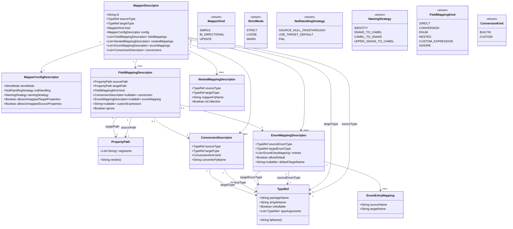

# Kraft – A Kotlin Multiplatform Auto-Mapper (KSP)

Kraft is a Kotlin Multiplatform (KMP) code-generation library that automatically generates type-safe mappers between data classes, enums, and nested structures — powered by **KSP (Kotlin Symbol Processing)**.

Keep full control through annotations. Let Kraft generate clean, predictable extension functions:

```kotlin
val dto = domainUser.toUserDto()
```

---

## ✨ Features

- **Automatic class-to-class mapping**
- **Config object–based mapping** (`@MapConfig`)
- **Nested mapping** (`NestedMapping`)
- **Converter functions** (`@MapUsing`)
- **Enum mapping** (`@EnumMap`)
- **Renamed / overridden fields**
- **Ignore target fields**
- **Customizable function naming**
- **Readable error messages**

---

## 📦 Installation

Add the dependencies:

```kotlin

kotlin {
    sourceSets {
        commonMain.dependencies{
            implementation("hu.nova.blu3berry.kraft:kraft-annotations:<version>")
        }
    }
}

dependencies {
    // KSP for KMP
    add("kspCommonMainMetadata", "hu.nova.blu3berry.kraft:kraft-ksp:<version>")
}
```


### Configure generated function names

Use `${target}` and `$source` as variables for the class names.

```kotlin
ksp {
    arg("kraft.functionNameFormat", "to${'$'}{target}From${'$'}{source}")
}
```

---

# 🧩 Mapping Types

## 1. Class Annotation Mapping (`@MapFrom`)

```kotlin
@MapFrom(UserDto::class)
data class User(val id: Int, val name: String)
```

Source:

```kotlin
data class UserDto(val id: Int, val name: String)
```

Generated:

```kotlin
fun UserDto.toUser(): User = User(
    id = this.id,
    name = this.name
)
```

---

## 2. Config Object Mapping (`@MapConfig`)

Config objects give full control:

```kotlin
@MapConfig(from = User::class, to = UserDto::class)
object UserMapping
```

Adds support for:
- Field overrides  
- Nested mapping  
- Converter functions 
---

## 3. Converter Functions (`@MapUsing`)

```kotlin
@MapConfig(from = User::class, to = UserDto::class)
object UserMapping {

    @MapUsing(from = "id", to = "id")
    fun mapId(id: Int): String = id.toString()
}
```

Generated:

```kotlin
id = UserMapping.mapId(this.id)
```

---

## 4. Nested Mapping (`NestedMapping`)

```kotlin
data class Store(val user: User)
data class StoreDto(val user: UserDto)

@MapConfig(
    from = Store::class,
    to = StoreDto::class,
    nestedMappings = [
        NestedMapping(from = User::class, to = UserDto::class)
    ]
)
object StoreMapping
```

Generated:

```kotlin
user = this.user.toUserDto()
```

---

## 5. Enum Mapping (`@EnumMap`)

```kotlin
@EnumMap(
    from = Status::class,
    to = ApiStatus::class,
    mappings = [
        EnumFieldMapping(from = "ACTIVE", to = "A"),
        EnumFieldMapping(from = "INACTIVE", to = "I")
    ]
)
object StatusEnumMapping
```

Generates:

```kotlin
fun Status.toApiStatus(): ApiStatus = when (this) {
    Status.ACTIVE -> ApiStatus.A
    Status.INACTIVE -> ApiStatus.I
}
```

---

# 📁 Project Structure

Generated files appear under:

```
.../build/generated/ksp/.../kotlin/
    user/generated/UserDtoToUserMapper.kt
    store/generated/StoreToStoreDtoMapper.kt
    enums/generated/StatusEnumMapper.kt
```

---

# 🛠️ Error Reporting

Kraft gives detailed, human-readable compiler errors:

```
Required property 'name' in target type 'UserDto' has no mapping source.
Fix:
  • Add @MapUsing(...)
  • Add NestedMapping
  • Provide default value
```

---

# 🤝 Contributing

Contributions are welcome!

---


IR representation:


