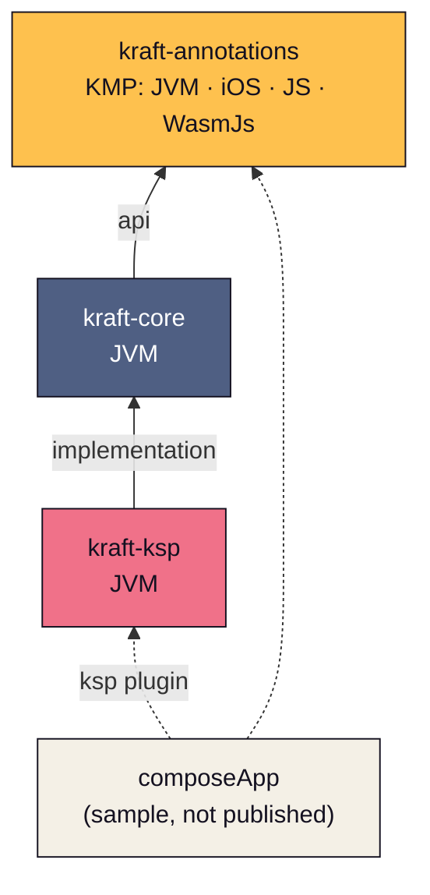
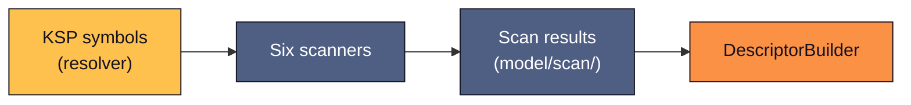
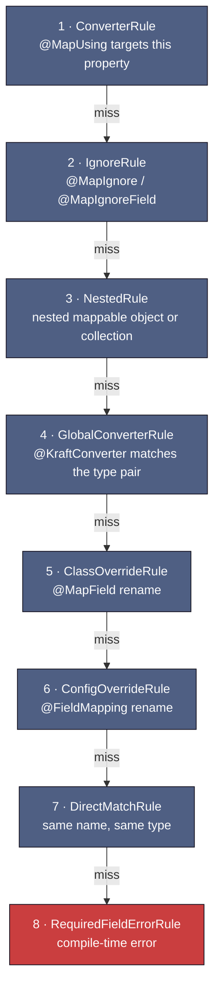
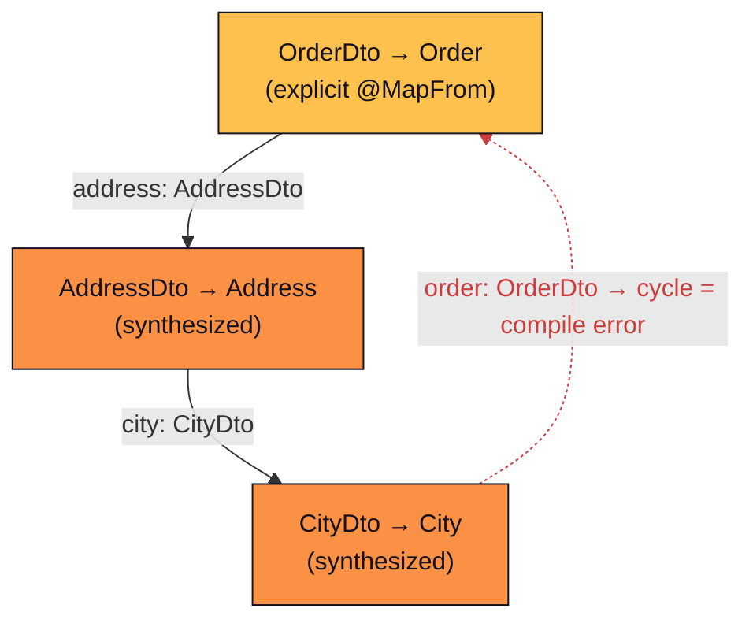
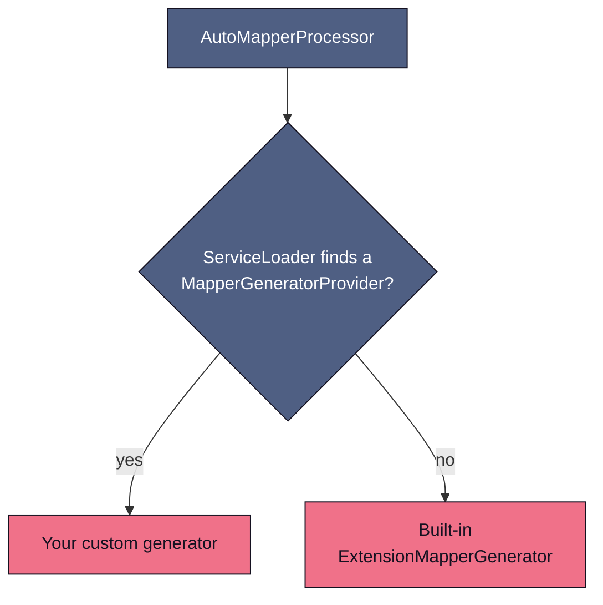

# Architecture

## How to read this codebase

Kraft is a KSP processor with one mental model: **annotations in, extension functions out, one intermediate representation in the middle.** Everything the processor does is a step toward building a `MapperDescriptor` (the IR) or a step consuming one.

```mermaid
flowchart LR
    A["<span style='color:#141120'>Your annotated classes<br/>@MapFrom · @MapTo<br/>@MapConfig · @MapEnum</span>"] --> S["<span style='color:#f4f0e6'>Scanners</span>"]
    S --> D["<span style='color:#f4f0e6'>DescriptorBuilder</span>"]
    D --> IR(["<span style='color:#141120'>MapperDescriptor<br/>(central IR)</span>"])
    IR --> G["<span style='color:#141120'>MapperGenerator</span>"]
    G --> OUT["<span style='color:#141120'>Generated .kt files<br/>(extension functions)</span>"]

    classDef anno fill:#fec14e,stroke:#141120,color:#141120
    classDef scan fill:#4f5f83,stroke:#141120,color:#ffffff
    classDef ir fill:#fb9144,stroke:#141120,color:#141120
    classDef gen fill:#f07189,stroke:#141120,color:#141120
    classDef out fill:#f4f0e6,stroke:#141120,color:#141120
    class A anno
    class S scan
    class D scan
    class IR ir
    class G gen
    class OUT out
```

The same colors are used on every diagram in this guide: **gold** = user input, **navy** = scanning/analysis, **orange** = the IR, **coral** = code generation, cream = generated output, **red** = error paths.

Fifteen-minute orientation, in reading order:

1. This page, top to bottom.
2. `AutoMapperProcessor.kt` (kraft-ksp) — the entry point; ~185 lines that call everything below in sequence.
3. `MapperDescriptor` (kraft-core, `model/descriptor/`) — the IR every phase reads or writes.
4. One test in `kraft-ksp/src/jvmTest` (e.g. `basic/`) — see how behavior is specified end to end.

Where to look when you have a task:

| I want to... | Start at |
|---|---|
| Change how an annotation is interpreted | `scanner/` (kraft-core) |
| Change which source property maps to a target property | `descriptor/propertyresolver/rules/` |
| Change the generated Kotlin code | `ExtensionMapperGenerator` / `CtorCallBuilder` (kraft-ksp) |
| Add a new annotation | [CONTRIBUTING.md](https://github.com/blu3berry-why/Kraft/blob/main/CONTRIBUTING.md), "How to Add a New Annotation" |
| Improve an error message | `util/LoggerExtensions.kt` |

---

## Module structure

- **kraft-annotations** — user-facing annotations (`@MapFrom`, `@MapTo`, `@MapConfig`, ...). Multiplatform because it is the only module that ends up on the *consumer's* compile classpath. No dependencies.
- **kraft-core** — everything up to and including the IR, plus the generator SPI. JVM-only (it depends on the KSP API).
- **kraft-ksp** — the KSP processor entry point and the built-in KotlinPoet-based generators. This is the artifact users add with `ksp(...)`.

| kraft-core package | Contents |
|---|---|
| `model/` | `MapperDescriptor`, `PropertyMappingStrategy`, `TypeInfo`, `PropertyInfo`, `MapperId` |
| `model/scan/` | Raw scan results |
| `scanner/` | The six scanners (table below) |
| `sides/` | `SideRegistry`, `AliasTemplate`, `PackageGlob` — side-alias support |
| `descriptor/` | `DescriptorBuilder`, `ClassDescriptorBuilder`, `ConfigDescriptorBuilder`, `ReverseDescriptorBuilder` |
| `descriptor/propertyresolver/` | `PropertyResolver` + the `MappingRule` chain |
| `codegen/` | `MapperGenerator` SPI, `GenerationConfig`, provider interfaces |
| `util/` | `KraftKspConstants`, `AnnotationExtensions`, `LoggerExtensions` |

| kraft-ksp file | Role |
|---|---|
| `AutoMapperProcessor` | KSP `SymbolProcessor` entry point |
| `AutoMapperProcessorProvider` | ServiceLoader registration |
| `ExtensionMapperGenerator` | Built-in generator (extension functions via KotlinPoet) |
| `EnumMapperGenerator` | Built-in enum mapper generator |
| `CtorCallBuilder` | Builds constructor-invocation CodeBlocks |
| `TypeInfoExt` | Bridge: `TypeInfo` → KotlinPoet `ClassName` |
| `CodeGenUtils` | File naming, banner utilities |

---

## Phase 1: Scanning

Scanners read KSP symbols and produce raw scan results — no resolution logic yet, just structured facts about what the user declared.

| Scanner | Reads | Produces |
|---|---|---|
| `ClassAnnotationScanner` | `@MapFrom` / `@MapTo` on data classes | `ClassMappingScanResult` — source/target types, field overrides, converters, ignored properties |
| `ConfigObjectScanner` | `@MapConfig` companion objects | `ConfigObjectScanResult` — bulk renames, shared converters, field mappings declared outside the class |
| `EnumMapScanner` | `@MapEnum` | `EnumMappingDescriptor` — enum constant correspondence |
| `GlobalConverterScanner` | top-level `@KraftConverter` functions in the current module | `GlobalConverterRegistry` indexed by `(sourceType, targetType)` |
| `ClasspathConverterScanner` | `@KraftConverterDelegate` extensions published by upstream Kraft modules | classpath-scoped `GlobalConverterRegistry` |
| `AutoEnumMappingDeriver` | every parent mapping pair | synthesized `EnumMappingDescriptor`s for same-module enum pairs with matching entry names (skips pairs already covered by `@MapEnum` or `@KraftConverter`) |

---

## Phase 2: Descriptor building

`DescriptorBuilder` converts scan results into `MapperDescriptor`, the central IR. This phase resolves property mappings via the rule chain, validates type compatibility, and resolves implicit nested dependencies (both below). Concrete builders: `ClassDescriptorBuilder`, `ConfigDescriptorBuilder`, and `ReverseDescriptorBuilder` (for `@MapReverse` bidirectional mappings).

### The property resolver rule chain

For every target property, `PropertyResolver` walks this chain top to bottom. **The first rule that matches produces the property's `PropertyMappingStrategy`**; a miss falls through to the next rule. This chain is the heart of the library — most mapping behavior questions are answered by "which rule claimed this property, and why".

Ordering notes worth knowing:

- `GlobalConverterRule` deliberately runs **before** the rename rules and `DirectMatchRule` so it can claim mismatched-type pairs before those rules would emit a type-mismatch error (see its KDoc).
- `RequiredFieldErrorRule` is terminal: reaching it means the property is required (non-nullable, no default) and nothing could resolve it, so compilation fails with a detailed message from `LoggerExtensions`.

Rules live in `kraft-core/.../descriptor/propertyresolver/rules/`, one file each; the order is defined in `PropertyResolver.kt`.

### Implicit nested dependency resolution

When a descriptor references a nested type pair with no explicit mapper, `DescriptorBuilder` synthesizes one, depth-first:

1. For each `NestedMapper` strategy, check whether a descriptor already exists for the nested pair.
2. If not, synthesize a minimal descriptor with `ClassDescriptorBuilder`.
3. Recurse into the synthesized descriptor's own nested dependencies.
4. Cycles are detected with gray/black DFS coloring and reported as compile-time errors (red edge above).

---

## Phase 3: Code generation

`MapperGenerator` implementations consume `MapperDescriptor` and emit Kotlin source files. The built-in `ExtensionMapperGenerator` produces extension functions (`fun SourceDto.toTarget(): Target`); the phase is pluggable via a ServiceLoader SPI:

The same pattern applies to `EnumMapperGeneratorProvider`. The SPI is marked `@ExperimentalKraftApi` (opt-in required; it may change in any release). For the step-by-step guide and a working example, see [Adding a Custom Code Generator](custom-code-generator.md).

---

## Key types

### MapperDescriptor

The central intermediate representation. Contains:

- `id: MapperId` — unique source/target qualified name pair.
- `sourceType / targetType: TypeInfo` — source and target class info.
- `propertyMappings: List<PropertyMappingStrategy>` — resolved strategy for each target property.
- `nestedMappings: List<NestedMappingDescriptor>` — child mapper dependencies.
- `converters: List<ConverterDescriptor>` — `@MapUsing` converter functions. Each carries a `resolvedDirection` (`AUTO`, `FORWARD`, or `REVERSE`) for directional filtering when `@MapReverse` is active.
- `aliasEmitMode: AliasEmitMode` — controls whether and how the side-alias delegate is emitted; defaults to `INHERIT`.

### PropertyMappingStrategy (sealed interface)

Six variants:

| Variant | Description | Example |
|---|---|---|
| `Direct` | Same name, same type | `name = this.name` |
| `Renamed` | Different name, same type | `id = this.userId` |
| `ConverterFunction` | Custom converter | `label = Mapper.convert(this.count)` |
| `NestedMapper` | Nested object | `address = this.address.toAddressDto()` |
| `Constant` | Literal value (reserved for future use) | — |
| `Ignored` | Property skipped (must have default) | — |

### TypeInfo

Wraps a KSP type with metadata:

- `declaration: KSClassDeclaration` — KSP class declaration.
- `ksType: KSType` — resolved type for equality checks.
- `packageName / simpleName` — plain strings (no KotlinPoet dependency in kraft-core).
- `qualifiedName` — delegates to KSP's `declaration.qualifiedName?.asString()`, which correctly handles nested types; falls back to `"$packageName.$simpleName"` only for anonymous or local declarations.
- `isNullable: Boolean`.

### MappingContext

Aggregated context passed to each `MappingRule`:

- Source properties, class-level renames, config-level renames.
- Converters, nested mappings, ignored properties.
- Logger for error reporting.
