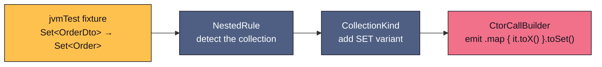

# Contributing

New to the codebase? Read [Architecture](architecture.md) first — 15 minutes gets you the mental model. This page shows what a real contribution looks like and where to start. Mechanics (detekt, commit format, test infrastructure, release process) live in [CONTRIBUTING.md](https://github.com/blu3berry-why/Kraft/blob/main/CONTRIBUTING.md) at the repo root.

## The dev loop

```bash
git clone https://github.com/blu3berry-why/Kraft.git
cd Kraft
./gradlew :kraft-ksp:jvmTest   # the full test suite
```

All behavior is specified by compile-testing tests in `kraft-ksp/src/jvmTest`: each test compiles a small fixture with the processor attached and asserts on the generated code or the compiler error. Write the test **first** — it is the fastest way to see the pipeline run end to end. Before writing one, skim the [KSP Compile-Testing Gotchas](ksp-compile-testing-gotchas.md); both gotchas on that page cost real debugging hours.

## Anatomy of a feature

How `Set<T>` collection mapping actually landed — the template for most "support a new shape" features. One property kind, four touch points, one pass through the pipeline:



1. **Test first** — a fixture with a `Set<OrderDto>` property and an assertion on the generated mapper.
2. **Detection** (`descriptor/propertyresolver/rules/NestedRule.kt`) — teach the rule to recognize the new shape and record it on the strategy.
3. **Model** (`model/descriptor/CollectionKind.kt`) — add the variant so the IR carries the fact to the generator.
4. **Emission** (`kraft-ksp/.../CtorCallBuilder.kt`) — handle the variant when building the constructor call.

Notice the shape: *rule → IR → generator*, never a shortcut from rule to generator. If your change wants to skip the IR, it is probably in the wrong place.

## Good first contributions

- **`Map<K,V>` collection mapping** — the exact same four touch points as the `Set<T>` walkthrough above (emit `.mapValues { (_, v) -> v.toX() }`). The pattern is proven; the walkthrough is your map.
- **Error-message improvements** — all compiler errors live in one file (`kraft-core/.../util/LoggerExtensions.kt`); making one clearer is a self-contained PR with an error-path test.
- **Docs fixes** — every page of this site is markdown under `docs/`; the site builds with `mkdocs serve`.

Check the [open issues](https://github.com/blu3berry-why/Kraft/issues) for what is currently wanted, and open one first for anything larger than the items above so the approach can be agreed before you build.
