# Adding a Custom Code Generator

Kraft's code generation phase is pluggable via a **ServiceLoader-based SPI**. Instead of (or alongside) the built-in extension function generator, you can provide your own `MapperGenerator` that consumes the same intermediate representation (`MapperDescriptor`) and emits any output you need — interface adapters, JSON schemas, documentation, test stubs, or anything else.

---

## Data Structure Diagram

The diagram below shows the IR types your generator receives. `MapperDescriptor` is the central node — everything a generator needs is reachable from it.

```mermaid
classDiagram
    direction TB

    class MapperGeneratorProvider {
        <<fun interface>>
        +create(environment: GeneratorEnvironment) MapperGenerator
    }

    class GeneratorEnvironment {
        +logger: KSPLogger
        +options: Map~String, String~
        +config: GenerationConfig
    }

    class GenerationConfig {
        +functionNameTemplate: String
        +functionNameFor(descriptor: MapperDescriptor) String
        +functionNameFor(sourceSimple: String, targetSimple: String) String
    }

    class MapperGenerator {
        <<fun interface>>
        +generate(descriptor: MapperDescriptor, codeGenerator: CodeGenerator)
    }

    class MapperDescriptor {
        +id: MapperId
        +sourceType: TypeInfo
        +targetType: TypeInfo
        +source: MappingSource
        +propertyMappings: List~PropertyMappingStrategy~
        +nestedMappings: List~NestedMappingDescriptor~
        +enumMappings: List~EnumMappingDescriptor~
        +converters: List~ConverterDescriptor~
        +nestedDependencies: Set~MapperId~
    }

    class MapperId {
        +sourceQualifiedName: String
        +targetQualifiedName: String
    }

    class TypeInfo {
        +declaration: KSClassDeclaration
        +ksType: KSType
        +packageName: String
        +simpleName: String
        +isNullable: Boolean
        +qualifiedName: String
    }

    class PropertyInfo {
        +name: String
        +type: TypeInfo
        +declaration: KSPropertyDeclaration
        +hasDefault: Boolean
    }

    class MappingSource {
        <<sealed interface>>
    }
    class ClassAnnotation {
        +annotatedClass: KSClassDeclaration
        +direction: MappingDirection
    }
    class ConfigObject {
        +configObject: KSClassDeclaration
    }

    class MappingDirection {
        <<enum>>
        MAP_FROM
        MAP_TO
    }

    class PropertyMappingStrategy {
        <<sealed interface>>
        +targetProperty: PropertyInfo
    }
    class Direct {
        +sourceProperty: PropertyInfo
    }
    class Renamed {
        +sourceProperty: PropertyInfo
    }
    class ConverterFunction {
        +source: ConverterSource
        +converter: ConverterDescriptor
    }
    class NestedMapper {
        +sourceProperty: PropertyInfo
        +nestedMappingDescriptor: NestedMappingDescriptor
    }
    class Constant {
        +expression: String
    }
    class Ignored

    class NestedMappingDescriptor {
        +nestedMapperId: MapperId
        +sourceType: TypeInfo
        +targetType: TypeInfo
        +collectionKind: CollectionKind?
        +isCollection: Boolean
    }

    class CollectionKind {
        <<enum>>
        LIST
        SET
    }

    class EnumMappingDescriptor {
        +sourceType: TypeInfo
        +targetType: TypeInfo
        +entries: List~EnumEntryMapping~
    }

    class EnumEntryMapping {
        +source: String
        +target: String
    }

    class ConverterDescriptor {
        +enclosingObject: KSClassDeclaration?
        +function: KSFunctionDeclaration
        +sourcePropertyName: String?
        +targetPropertyName: String
        +sourceType: TypeInfo
        +targetType: TypeInfo
        +functionName: String
        +isExtension: Boolean
    }

    class ConverterSource {
        <<sealed interface>>
    }
    class Property {
        +info: PropertyInfo
    }
    class WholeObject {
        +sourceType: TypeInfo
    }

    class EnumMapperGeneratorProvider {
        <<fun interface>>
        +create(environment: GeneratorEnvironment) EnumMapperGeneratorSpi
    }

    class EnumMapperGeneratorSpi {
        <<fun interface>>
        +generate(descriptors: List~EnumMappingDescriptor~, codeGenerator: CodeGenerator)
    }

    %% SPI wiring
    MapperGeneratorProvider --> GeneratorEnvironment : receives
    MapperGeneratorProvider --> MapperGenerator : creates
    GeneratorEnvironment --> GenerationConfig
    MapperGenerator --> MapperDescriptor : consumes

    EnumMapperGeneratorProvider --> GeneratorEnvironment : receives
    EnumMapperGeneratorProvider --> EnumMapperGeneratorSpi : creates
    EnumMapperGeneratorSpi --> EnumMappingDescriptor : consumes

    %% MapperDescriptor relationships
    MapperDescriptor --> MapperId : id
    MapperDescriptor --> TypeInfo : sourceType / targetType
    MapperDescriptor --> MappingSource : source
    MapperDescriptor --> PropertyMappingStrategy : propertyMappings *
    MapperDescriptor --> NestedMappingDescriptor : nestedMappings *
    MapperDescriptor --> EnumMappingDescriptor : enumMappings *
    MapperDescriptor --> ConverterDescriptor : converters *

    %% MappingSource hierarchy
    MappingSource <|-- ClassAnnotation
    MappingSource <|-- ConfigObject
    ClassAnnotation --> MappingDirection

    %% PropertyMappingStrategy hierarchy
    PropertyMappingStrategy <|-- Direct
    PropertyMappingStrategy <|-- Renamed
    PropertyMappingStrategy <|-- ConverterFunction
    PropertyMappingStrategy <|-- NestedMapper
    PropertyMappingStrategy <|-- Constant
    PropertyMappingStrategy <|-- Ignored
    PropertyMappingStrategy --> PropertyInfo : targetProperty

    Direct --> PropertyInfo : sourceProperty
    Renamed --> PropertyInfo : sourceProperty
    NestedMapper --> PropertyInfo : sourceProperty
    NestedMapper --> NestedMappingDescriptor
    ConverterFunction --> ConverterDescriptor
    ConverterFunction --> ConverterSource

    %% ConverterSource hierarchy
    ConverterSource <|-- Property
    ConverterSource <|-- WholeObject
    Property --> PropertyInfo : info
    WholeObject --> TypeInfo : sourceType

    %% Nested & Enum
    NestedMappingDescriptor --> MapperId : nestedMapperId
    NestedMappingDescriptor --> TypeInfo : sourceType / targetType
    NestedMappingDescriptor --> CollectionKind

    EnumMappingDescriptor --> TypeInfo : sourceType / targetType
    EnumMappingDescriptor --> EnumEntryMapping : entries *

    ConverterDescriptor --> TypeInfo : sourceType / targetType

    %% PropertyInfo
    PropertyInfo --> TypeInfo : type
```



---

## Step-by-Step Guide

### 1. Create a Gradle Module

Create a new JVM module (or standalone project) for your generator:

```kotlin
// my-kraft-generator/build.gradle.kts
plugins {
    kotlin("jvm")
}

dependencies {
    implementation("com.blu3berry.kraft:kraft-core:<version>")
    // kraft-core brings in the KSP API transitively.
    // Add KotlinPoet only if your generator needs it — it is NOT required.
}
```

!!! note
    `kraft-core` does **not** depend on KotlinPoet. You are free to use any code-emission strategy — raw string templates, KotlinPoet, or your own writer.

### 2. Implement `MapperGeneratorProvider`

This is the ServiceLoader entry point. It receives a `GeneratorEnvironment` and returns your `MapperGenerator`:

```kotlin
class JsonSchemaGeneratorProvider : MapperGeneratorProvider {
    override fun create(environment: GeneratorEnvironment): MapperGenerator {
        return JsonSchemaGenerator(
            logger = environment.logger,
            config = environment.config,
            options = environment.options
        )
    }
}
```

### 3. Implement `MapperGenerator`

Your generator receives one `MapperDescriptor` per source-target pair. Use its fields to emit whatever output you need:

```kotlin
class JsonSchemaGenerator(
    private val logger: KSPLogger,
    private val config: GenerationConfig,
    private val options: Map<String, String>
) : MapperGenerator {

    override fun generate(descriptor: MapperDescriptor, codeGenerator: CodeGenerator) {
        val targetName = descriptor.targetType.simpleName
        val fileName = "${targetName}_schema"

        // Open an output file via the KSP CodeGenerator
        val file = codeGenerator.createNewFile(
            dependencies = Dependencies(aggregating = false),
            packageName = "",
            fileName = fileName,
            extensionName = "json"
        )

        val schema = buildString {
            appendLine("{")
            appendLine("""  "type": "object",""")
            appendLine("""  "title": "$targetName",""")
            appendLine("""  "properties": {""")

            descriptor.propertyMappings.forEachIndexed { index, strategy ->
                val propName = strategy.targetProperty.name
                val propType = strategy.targetProperty.type.simpleName
                val comma = if (index < descriptor.propertyMappings.lastIndex) "," else ""

                // Map Kotlin types to JSON Schema types
                val jsonType = when (propType) {
                    "String" -> "string"
                    "Int", "Long" -> "integer"
                    "Double", "Float" -> "number"
                    "Boolean" -> "boolean"
                    else -> "object"
                }

                appendLine("""    "$propName": { "type": "$jsonType" }$comma""")
            }

            appendLine("  }")
            appendLine("}")
        }

        file.write(schema.toByteArray())
        file.close()

        logger.info("Generated JSON schema: $fileName.json")
    }
}
```

### 4. Handle PropertyMappingStrategy Variants

When iterating `descriptor.propertyMappings`, handle each variant according to your output format:

```kotlin
fun processStrategies(descriptor: MapperDescriptor) {
    for (strategy in descriptor.propertyMappings) {
        when (strategy) {
            is PropertyMappingStrategy.Direct -> {
                // Same name, same type: source.x -> target.x
                val name = strategy.targetProperty.name
                val type = strategy.targetProperty.type
            }
            is PropertyMappingStrategy.Renamed -> {
                // Different name: source.oldName -> target.newName
                val sourceName = strategy.sourceProperty.name
                val targetName = strategy.targetProperty.name
            }
            is PropertyMappingStrategy.ConverterFunction -> {
                // Custom converter applied
                val converter = strategy.converter
                val targetName = strategy.targetProperty.name
            }
            is PropertyMappingStrategy.NestedMapper -> {
                // Delegates to a child mapper
                val nested = strategy.nestedMappingDescriptor
                val isCollection = nested.isCollection
            }
            is PropertyMappingStrategy.Constant -> {
                // Literal expression (reserved for future use)
                val expr = strategy.expression
            }
            is PropertyMappingStrategy.Ignored -> {
                // Property skipped — has a default value
            }
        }
    }
}
```

### 5. (Optional) Implement Enum Generator

If you also want to customize enum mapping output, implement the enum SPI:

```kotlin
class MyEnumGeneratorProvider : EnumMapperGeneratorProvider {
    override fun create(environment: GeneratorEnvironment): EnumMapperGeneratorSpi {
        return MyEnumGenerator(environment.logger, environment.config)
    }
}

class MyEnumGenerator(
    private val logger: KSPLogger,
    private val config: GenerationConfig
) : EnumMapperGeneratorSpi {

    override fun generate(
        descriptors: List<EnumMappingDescriptor>,
        codeGenerator: CodeGenerator
    ) {
        for (descriptor in descriptors) {
            // descriptor.sourceType / descriptor.targetType — the enum types
            // descriptor.entries — List<EnumEntryMapping> with source/target constant names
        }
    }
}
```

### 6. Register via ServiceLoader

Create the service file so `AutoMapperProcessor` can discover your provider at compile time.

For class mappers, create:

```text title="src/main/resources/META-INF/services/com.blu3berry.kraft.processor.codegen.MapperGeneratorProvider"
com.example.JsonSchemaGeneratorProvider
```

For enum mappers (optional), create:

```text title="src/main/resources/META-INF/services/com.blu3berry.kraft.processor.codegen.EnumMapperGeneratorProvider"
com.example.MyEnumGeneratorProvider
```

### 7. Wire into the Consumer Build

Add your generator module as a KSP dependency alongside `kraft-ksp`:

```kotlin
// app/build.gradle.kts
dependencies {
    ksp("com.blu3berry.kraft:kraft-ksp:<version>")
    ksp("com.example:my-kraft-generator:<version>")
}
```

Both your generator and the built-in one are on the KSP classpath, but only **one** `MapperGeneratorProvider` is used per compilation (see discovery rules below).

---

## GeneratorEnvironment Reference

Your provider's `create()` method receives a `GeneratorEnvironment` with:

| Field | Type | Description |
|-------|------|-------------|
| `logger` | `KSPLogger` | KSP logger — use `info()`, `warn()`, `error()` for compile-time messages. |
| `options` | `Map<String, String>` | All KSP processor options from `build.gradle.kts`. Read custom options here. |
| `config` | `GenerationConfig` | Holds the `functionNameTemplate` (default `"to${target}"`). Use `config.functionNameFor(descriptor)` to get the resolved function name. |

---

## Discovery and Fallback Behavior

`AutoMapperProcessor` uses `java.util.ServiceLoader` to find providers on the KSP classpath:

| Providers found | Behavior |
|-----------------|----------|
| **0** | Falls back to the built-in `ExtensionMapperGenerator`. |
| **1** | Uses that single provider. |
| **2+** | Uses the **first** provider found and logs a warning. |

The same logic applies independently to `EnumMapperGeneratorProvider`.

!!! warning
    If you provide a custom `MapperGeneratorProvider`, it **replaces** the built-in extension function generator entirely. If you still want extension functions alongside your custom output, call through to `ExtensionMapperGenerator` from within your generator, or structure your project so they are separate KSP executions.

---

## Tips

- **Function naming**: Use `config.functionNameFor(descriptor)` to respect the user's `kraft.functionNameFormat` KSP option. This keeps your generator consistent with the naming convention users configure.
- **Incremental processing**: Pass originating `KSFile` references to `Dependencies(...)` when creating output files. This allows KSP to skip regeneration when source files haven't changed.
- **Custom KSP options**: Read your own options from `environment.options`. For example, configure them in `build.gradle.kts`:

    ```kotlin
    ksp {
        arg("myGenerator.outputFormat", "json")
    }
    ```

    Then read in your generator:

    ```kotlin
    val format = options["myGenerator.outputFormat"] ?: "json"
    ```

- **Accessing nested info**: `descriptor.nestedDependencies` gives you the set of `MapperId`s this mapper depends on — useful if your output format needs to declare imports or references to child mappers.
- **Collection handling**: Check `NestedMappingDescriptor.collectionKind` to distinguish `List` vs `Set` wrappers on nested properties.
