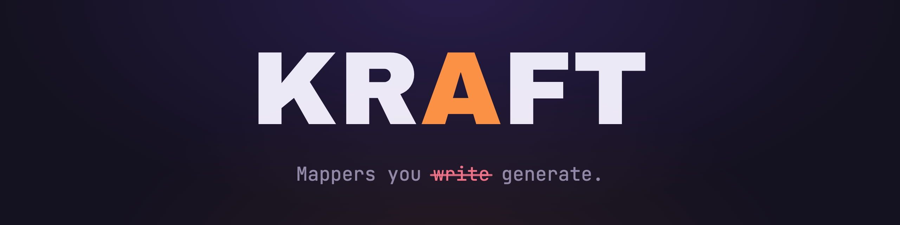

# 

[](https://central.sonatype.com/namespace/com.blu3berry.kraft)
[](https://github.com/blu3berry-why/Kraft/releases/latest)

Every Kotlin codebase has that file. Forty lines of `id = id, name = name, email = email` that nobody wanted to write and nobody wants to review. Kraft deletes it:

```diff
- fun User.toUserDto(): UserDto = UserDto(
-     id = id,
-     name = name,
-     email = email,
- )
+ @MapConfig(source = User::class, target = UserDto::class)
+ object UserMapper
```

```kotlin
val dto = user.toUserDto() // generated at compile time
```

That's the whole mapper. Kraft is a KSP processor that generates type-safe extension functions between your data classes — plain, readable Kotlin you can inspect in `build/generated`. No reflection, no runtime library, nothing to ship.

[Get started](user-guide/getting-started.md){ .md-button .md-button--primary }
[Browse the guide](user-guide/basic-mapping.md){ .md-button }

## What Kraft handles for you

<div class="grid cards" markdown>

- **Basic mapping**

    ---

    Same-name properties map automatically — `@MapConfig`, `@MapFrom`, or `@MapTo`, whichever fits your layering.

    [Basic Mapping →](user-guide/basic-mapping.md)

- **Nested objects & collections**

    ---

    Child mappers are auto-detected when types differ, and `List<T>` / `Set<T>` map their elements along the way.

    [Nested Mapping →](user-guide/nested-mapping.md)

- **Enums**

    ---

    `@MapEnum` matches entries by name and lets you pin the exceptions with custom entry pairs.

    [Enum Mapping →](user-guide/enum-mapping.md)

- **Custom converters**

    ---

    `@MapUsing` for one-off transformations, `@KraftConverter` for converters discovered across the whole classpath.

    [Custom Converters →](user-guide/custom-converters.md)

- **Reverse mapping**

    ---

    One `@MapReverse` and the inverse mapper is generated too — renames, converters, and ignores included.

    [Reverse Mapping →](user-guide/reverse-mapping.md)

- **AI-assisted workflows**

    ---

    A ready-made skill file teaches coding agents to write Kraft mappers correctly on the first try.

    [AI Integration →](user-guide/ai-integration.md)

</div>

## Install

Kraft is on **Maven Central** (`com.blu3berry.kraft`) — ensure `mavenCentral()` is in your `repositories { }` block, then replace `<version>` with the release shown in the badge above.

=== "Kotlin Multiplatform"

    ```kotlin
    // build.gradle.kts
    plugins {
        id("com.google.devtools.ksp") version "2.3.3"
    }

    kotlin {
        sourceSets {
            commonMain.dependencies {
                implementation("com.blu3berry.kraft:kraft-annotations:<version>")
            }
        }
    }

    dependencies {
        add("kspCommonMainMetadata", "com.blu3berry.kraft:kraft-ksp:<version>")
    }
    ```

=== "JVM / Android"

    ```kotlin
    // build.gradle.kts
    plugins {
        id("com.google.devtools.ksp") version "2.3.3"
    }

    dependencies {
        implementation("com.blu3berry.kraft:kraft-annotations:<version>")
        ksp("com.blu3berry.kraft:kraft-ksp:<version>")
    }
    ```

See [Getting Started](user-guide/getting-started.md) for requirements, KSP version matching, and legacy-project compatibility.

## Where next

- [Getting Started](user-guide/getting-started.md) — installation and your first mapper
- [User Guide](user-guide/basic-mapping.md) — every feature, with examples
- [Architecture](developer-guide/architecture.md) — internals and the plugin SPI
- [Contributing](https://github.com/blu3berry-why/Kraft/blob/main/CONTRIBUTING.md) — issues and PRs welcome
